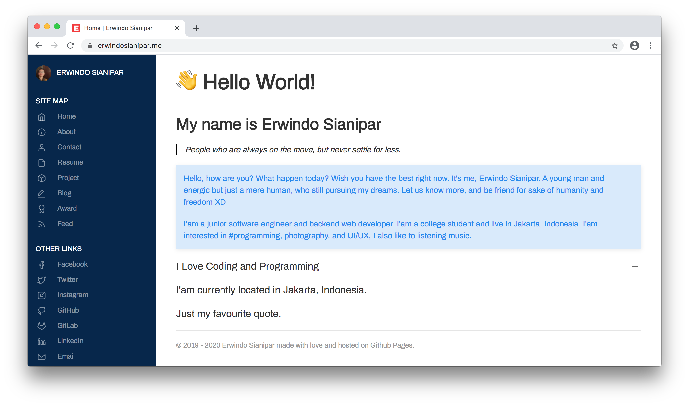

# erwindosianipar.github.io
Hello World! This is me on the Internet  

## This is my personal site

This script is i'am using to generate a web static site generator for my personal website.
Make with Jekyll static site generator.

## What is GitHub Pages?

GitHub Pages is a system built into GitHub that allows you to build websites directly from a GitHub Repository.

## Link
[https://erwindosianipar.me](https://erwindosianipar.me)



## Build

To Read this blog locally, you need to clone this repository

```
$ git clone --depth 1 https://github.com/erwindosianipar/erwindosianipar.github.io erwindosianipar-blog
```

Then run Jekyll server:

```
$ cd erwindosianipar-blog
$ bundle exec jekyll serve
```
